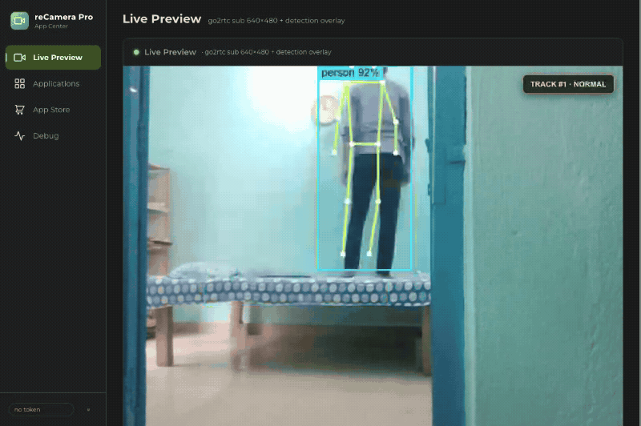
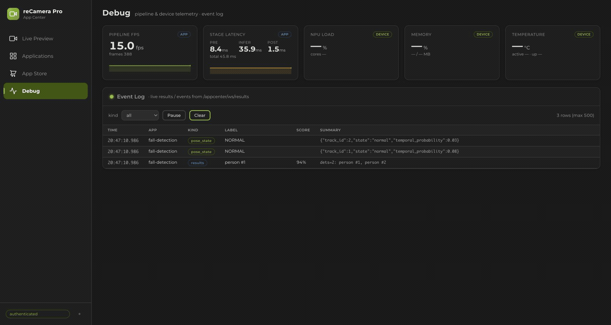
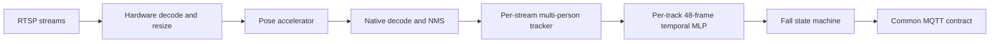

# EdgeFallKit

**15 FPS multi-person fall detection across Jetson, Hailo, RKNN, and reCamera.**


EdgeFallKit is one fall-detection stack verified on NVIDIA Jetson Orin Nano/NX, Rockchip
RK3576/RK3588, Raspberry Pi 5 + Hailo-8, reCamera SG2002, and reCamera Pro.
Python owns the readable control plane where the platform supports it; video
decode, preprocessing, inference, and pose postprocessing stay in GStreamer,
CUDA/TensorRT, RKNN, HailoRT, or small native extensions.

The repository includes multi-stream RTSP ingestion, independent tracking and
temporal state for every person, a common MQTT result contract, slim published
runtime images, one-command model preparation, and reproducible performance and
accuracy evidence. It is an engineering reference implementation, **not a
medical or emergency-response certification**.



*Live Preview demo using a recorded GMDCSA fall clip and its reCamera Pro
RV1126B pose trace. The production panel renders the video, tracking box,
skeleton, and state transition together. State playback is for UI
visualization; accuracy and performance claims come from the frozen evaluation
reports below.*

[Demo provenance and source hashes](assets/demo/README.md)



*Debug-panel demo using the production reCamera Pro WebSocket result schema.
The two-person state sequence is injected for visualization; it is not accuracy
or performance evidence.*

## Highlights

- **One result contract:** every platform publishes the same reCamera-compatible
  MQTT schema with `stream_id`, `persons[]`, stable track IDs, and stream-global
  event IDs.
- **Real multi-person state:** each track owns an independent 48-frame temporal
  MLP and fall state machine; short occlusion does not silently swap histories.
- **Hardware-first hot paths:** Jetson NVDEC/VIC/CUDA/TensorRT, Rockchip
  MPP/RGA/RKNN plus C++ NMS, Hailo GStreamer/HailoRT, and native CVI inference.
- **Readable deployment:** Python controls RTSP reconnects, configuration,
  orchestration, tracking, and MQTT on Jetson/RK; production images contain no
  Torch, Ultralytics, ONNX Runtime, compiler, or model converter.
- **Models stay external:** an explicit-license helper downloads from the
  upstream provider, converts on the correct builder/target, verifies hashes,
  and reuses a provenance-aware cache.
- **Measured, not estimated:** device reports separate accelerator inference,
  pipeline throughput, CPU, RSS, utilization, power when available, image size,
  and accuracy scope.

## Quickstart

Choose a platform, review the upstream model terms, and run the dispatcher:

```bash
./deploy.sh jetson --device orin-nano --accept-upstream-license --deploy
./deploy.sh rk3576 --device cat-remote --accept-upstream-license
./deploy.sh rk3588 --device radxa --accept-upstream-license
./deploy.sh hailo --accept-upstream-license
```

The command pulls the published slim runtime, prepares the external pose model,
verifies its manifest, validates Compose, and starts the selected service.
Start with `--dry-run`; see [Deployment](docs/DEPLOYMENT.md) for offline, local
model, remote builder, and image override options.

Before deployment, edit the platform configuration with real RTSP URLs, stable
stream IDs, and MQTT broker/TLS credentials. Example addresses are not
production defaults.

## Contents

- [Highlights](#highlights)
- [Quickstart](#quickstart)
- [Supported platforms](#supported-platforms)
- [Measured results](#measured-results)
- [How it works](#how-it-works)
- [Published images and models](#published-images-and-models)
- [Configuration and MQTT](#configuration-and-mqtt)
- [Reproducible evaluation](#reproducible-evaluation)
- [Repository layout](#repository-layout)
- [Development and verification](#development-and-verification)
- [reCamera source layout](#recamera-source-layout)
- [Safety, licensing, and security](#safety-licensing-and-security)
- [Contributing](#contributing)
- [Acknowledgements](#acknowledgements)

## Supported platforms

| Platform | Control plane | Accelerated path | Deployment status |
|---|---|---|---|
| Jetson Orin Nano/NX | Python | NVDEC/VIC → CUDA preprocess → TensorRT 10.3 | Published RC1; Nano/NX pull-back verified |
| RK3576/RK3588 | Python | MPP/RGA → RKNNLite → pybind11 decode/NMS | Published RC2; both boards pull-back verified |
| Raspberry Pi 5 + Hailo-8 | Native runtime; Python-control migration documented | GStreamer → `hailonet` or shared HailoRT batch → native tensor decode | Published RC3; Pi pull-back verified |
| reCamera SG2002 | Native C++ | CVI Runtime INT8 | appMgr package; OS 0.2.2 verified |
| reCamera Pro | Python app | RV1126B RKNN | Signed package, live target, and frozen native/fallback S4 comparison verified |

SG2002 intentionally remains native C++: adding Python would not improve its
throughput or reliability. Hailo currently keeps the hot runtime native because
HailoRT 4.21 exposes tensor metadata through a C++ API but not the installed
Python GI bridge; the exact migration boundary is documented in
[PYTHON_CONTROL_PLANE.md](platforms/rpi-hailo/PYTHON_CONTROL_PLANE.md).

## Measured results

All figures below are evidence collected on 2026-08-13, 2026-08-20,
2026-08-30, 2026-09-01, 2026-09-02, and 2026-09-05. Different models and latency scopes are shown
explicitly; see the
[full results ledger](evaluation/RESULTS.md) before making a capacity or
accuracy claim.

### Production RTSP path

| Device | Pose frontend | Highest tested live/RTSP load | Next boundary / coverage |
|---|---|---:|---:|
| Orin Nano Super | YOLO11s-Pose TRT FP16 | 8 streams: 14.95 FPS each | 9 streams failed at 13.36 FPS each |
| Orin NX Super | YOLO11s-Pose TRT FP16 | 9 streams: 14.93 FPS each | 10 streams failed at 13.05 FPS each |
| RK3576 | YOLOv8s-Pose RKNN INT8, MPP NV12 path | 1 stream: 14.83–15.01 FPS (3/3) | 2 streams: 12.81–12.83 FPS; **1 × 15 FPS verified** |
| RK3588 | YOLOv8s-Pose RKNN INT8, MPP NV12 path | 5 streams: 14.97–15.01 FPS each (3/3) | 6 streams: 14.43–14.49 FPS; **5 × 15 FPS verified** |
| Pi 5 + Hailo-8 | YOLOv8s-Pose quantized HEF, single context | 16 streams: 14.52–14.57 FPS each | 17 streams failed the 14.5 FPS threshold |
| Pi 5 + Hailo-8 | YOLOv8m-Pose quantized HEF, 3 contexts | 5 streams: 14.98–15.02 FPS each | 6 streams failed the 14.5 FPS threshold |
| reCamera Pro | YOLO11n-Pose RKNN INT8 | 1 live camera: 13.05 FPS WebSocket | Higher live loads not tested; 14.5 FPS SLA not met |

The 15 FPS rows are source-rate SLA checks, not a hardware ranking. They do not
mix accelerator, application-inference, pipeline, or output-interval timing in
one column. Timing boundaries and known risks are documented in the
[performance fairness audit](evaluation/PERFORMANCE_FAIRNESS.md).
The Hailo S/M capacity boundaries were measured with MQTT publishing disabled;
the rc3 image was separately smoke-tested with MQTT enabled for one S stream
and one M stream. Earlier MQTT contract evidence remains in the
[Hailo platform report](platforms/rpi-hailo/README.md#benchmark).
The Jetson boundaries are MQTT-published RTSP results using YOLO11s on Super
modules; they do not establish YOLO11m multi-stream capacity. Earlier Jetson
`--infStreams` runs and RK multi-context runs are accelerator-only evidence,
not RTSP route-count verification. A single tested reCamera Pro source is test
coverage, not a measured maximum.

The RK rows use the same fixed 640x640 H.264@15 source and MQTT wall-clock
output contract. `inference_ms` excludes video preprocessing; `pipeline_ms`
starts when the source read returns. The production Python path uses MPP NV12
decode plus CPU color conversion/resize. A separate RK3588 hybrid experiment
moved DMA-BUF→serialized RGA RGB and RKNN `set_io_mem` into a native stage; it
is performance-only (no pose/tracker/temporal/MQTT output), so its CPU and
latency reduction must not be promoted to production capacity or precision
equivalence. The frozen RK measurements and artifact identities are in the
[aligned RK report](evaluation/reports/rk-s-int8-aligned-20260905.md).

### Named application timing

These intervals are useful within one platform but do not share the same start
and end markers. `N/A` means the runtime does not instrument that interval.

| Device / model | Output cadence | Application inference | Named pipeline interval |
|---|---:|---:|---:|
| Orin Nano Super / YOLOv8s calibrated INT8 | 14.79 FPS | 5.35 / 5.40 ms mean/P95 | N/A |
| Orin Nano Super / YOLOv8s FP16 | 14.42 FPS | 7.66 / 7.72 ms mean/P95 | N/A |
| Orin Nano Super / YOLOv8m calibrated INT8 | 14.35 FPS | 9.92 / 9.98 ms mean/P95 | N/A |
| Orin Nano Super / YOLOv8m FP16 | 14.04 FPS | 14.94 / 14.98 ms mean/P95 | N/A |
| Orin NX Super / YOLOv8s calibrated INT8 | 14.80 FPS | 4.82 / 4.86 ms mean/P95 | N/A |
| Orin NX Super / YOLOv8s FP16 | 14.53 FPS | 6.82 / 6.87 ms mean/P95 | N/A |
| Orin NX Super / YOLOv8m calibrated INT8 | 14.35 FPS | 8.86 / 8.90 ms mean/P95 | N/A |
| Orin NX Super / YOLOv8m FP16 | 14.13 FPS | 13.19 / 13.27 ms mean/P95 | N/A |
| Pi 5 + Hailo-8 / YOLOv8s | 15.00–15.06 FPS | N/A | 7.47–7.51 ms mean; 7.99–8.10 ms P95, `pre_hailonet_to_hailonet_src` |
| Pi 5 + Hailo-8 / YOLOv8m | 14.12–14.16 FPS | N/A | 28.52–28.89 ms mean; 32.30–37.86 ms P95, `appsink_enqueue_to_hailort_completion` |
| reCamera Pro / YOLO11n | 13.05 FPS WebSocket | 35.89 / 39.36 ms mean/P95 | 77.80 / 85.99 ms mean/P95, Pro application scope |

Jetson's application interval includes preprocess, copies, TensorRT, output
copy and pose parsing. Hailo's two probes have different start markers and are
not substituted for `inference_time_ms`. Accelerator-only results for the
aligned YOLOv8 S/M comparison are reported separately below and in the
[results ledger](evaluation/RESULTS.md).

### Aligned accelerator-only YOLOv8 comparison

All rows use 640-square input, batch 1, one runtime inference stream, 30 seconds
warm-up and 120 seconds × 3; values are medians. TensorRT rows report GPU
compute time. Hailo rows report HailoRT hardware latency. Other inference
applications were stopped on each device before measurement.

| Device | Model / executable precision | Aggregate FPS | Accelerator mean | P95 |
|---|---|---:|---:|---:|
| Orin Nano Super | YOLOv8s-Pose calibrated INT8 + FP16 fallback | 266.34 | 3.75 ms | 3.76 ms |
| Orin Nano Super | YOLOv8s-Pose FP16 | 169.66 | 5.89 ms | 5.91 ms |
| Orin Nano Super | YOLOv8m-Pose calibrated INT8 + FP16 fallback | 123.22 | 8.11 ms | 8.14 ms |
| Orin Nano Super | YOLOv8m-Pose FP16 | 76.64 | 13.05 ms | 13.32 ms |
| Orin NX Super | YOLOv8s-Pose calibrated INT8 + FP16 fallback | 299.61 | 3.34 ms | 3.34 ms |
| Orin NX Super | YOLOv8s-Pose FP16 | 192.37 | 5.20 ms | 5.20 ms |
| Orin NX Super | YOLOv8m-Pose calibrated INT8 + FP16 fallback | 139.16 | 7.18 ms | 7.20 ms |
| Orin NX Super | YOLOv8m-Pose FP16 | 88.26 | 11.33 ms | 11.35 ms |
| Pi 5 + Hailo-8 | YOLOv8s-Pose quantized HEF, 1 compiled context | 326.33 HW-only | 6.93 ms | N/A |
| Pi 5 + Hailo-8 | YOLOv8m-Pose quantized HEF, 3 compiled contexts | 31.00 HW-only | 26.89 ms | N/A |

The Jetson INT8 rows in this 2026-09-01 accelerator-only table use an entropy
calibrator and the same 64 GMDCSA image contents on both Orins; the previous
uncalibrated TensorRT INT8 timing is excluded. Real
RTSP person frames were also tested to reject timing-only engines with unusable
outputs. This is a performance and runtime sanity comparison, not INT8
accuracy equivalence: the calibration candidates include Subject 4, so these
engines cannot refresh the frozen S4 accuracy table. INT8 and FP16 fall-state
counts also differed substantially in the RTSP windows. A frontend-specific
INT8 temporal profile and trace/deployed evaluation were also run. The repaired
M engine and its disjoint 494-image calibration set are reported separately
below; its application timing must not replace these GPU-only measurements.
The complete core, context, application and artifact records are in the
[structured Jetson report](evaluation/reports/jetson-yolov8-crossprecision-20260901.json).

Hailo-8 HEFs do not expose a runtime FP16 mode. Batch 8 raises M aggregate
throughput to 88.46 FPS at 70.10 ms for the complete batch; that latency is not
divided by eight and relabeled as single-frame latency. The S HEF did not gain
sustained throughput from batch 8. See the
[structured Hailo report](evaluation/reports/rpi-hailo8-aligned-20260901.json).

### Jetson INT8 and mixed-precision validation

`temporal_profile=auto` selects independent YOLOv8s and YOLOv8m profiles from
the engine filename. The original M engine allowed the complete graph to use
INT8 and lost pose spans after a person fell: deployed F1 was 0% and coverage
was 64.5% on NX and 64.7% on Nano. More calibration images and an FP16 Pose-only
head did not repair those spans.

The repaired M engine uses 494 phase-balanced calibration images from Subjects
1–3, with no Subject 4 images. TensorRT may use INT8 for backbone `model.0–9`;
floating-point neck, Detect and Pose layers in `model.10–22` are constrained to
FP16. The M temporal weights are fit on Subjects 1–2 using S INT8 and repaired M
traces, selected on Subject 3 by worst-frontend F1, then refit on Subjects 1–3.
Other GPU applications were stopped during both device runs.

| Device / frontend | Temporal TP/FN/TN/FP, F1 | Deployed TP/FN/TN/FP, F1 | Pose coverage | Application inference |
|---|---|---|---:|---:|
| Orin Nano Super / YOLOv8s INT8 | 9/3/13/2, 78.3% | 7/5/13/2, 66.7% | 78.3% | 5.28 ms mean |
| Orin NX Super / YOLOv8s INT8 | 9/3/13/2, 78.3% | 7/5/13/2, 66.7% | 78.3% | 4.72 ms mean |
| Orin Nano Super / YOLOv8m mixed INT8/FP16 | 9/3/14/1, 81.8% | 10/2/14/1, 87.0% | 94.5% | 12.84 ms mean |
| Orin NX Super / YOLOv8m mixed INT8/FP16 | 9/3/14/1, 81.8% | 10/2/14/1, 87.0% | 94.5% | 11.31 ms mean |

The mixed M interval includes preprocess, copies, TensorRT, output copy and
pose parsing; it is not substituted into the GPU-only table above. Calibration
and fitting exclude Subject 4, but earlier failed M investigations had already
observed that subject, so this is regression evidence rather than a pristine
one-shot publication holdout. Build hashes, precision boundaries and raw
reports are in the
[structured repair report](evaluation/reports/jetson-yolov8m-mixed-20260902.json).

### GMDCSA Subject 4 results

| Frontend/profile | Accuracy | Recall | Specificity | F1 | Mean alert latency |
|---|---:|---:|---:|---:|---:|
| reCamera CVI baseline | 74.1% | 83.3% | 66.7% | 74.1% | 1.75 s |
| Jetson YOLO11s optimized | 81.5% | 83.3% | 80.0% | 80.0% | 1.47 s |
| Jetson YOLO11m optimized | 85.2% | 100% | 73.3% | 85.7% | 1.26 s |
| Jetson YOLOv8m mixed INT8/FP16 repaired | 88.9% | 83.3% | 93.3% | 87.0% | 1.43 s |
| RK3576 native temporal gate | 88.9% | 100% | 80.0% | 88.9% | 1.49 s |
| RK3588 native temporal gate | 88.9% | 100% | 80.0% | 88.9% | 1.53 s |
| reCamera Pro production fallback on Pro traces | 81.5% | 91.7% | 73.3% | 81.5% | 1.22 s |
| reCamera Pro native experiment | 70.4% | 75.0% | 66.7% | 69.2% | 1.47 s |
| Hailo-8 native temporal gate | 88.9% | 100% | 80.0% | 88.9% | 1.61 s |

The historical frozen test has 27 clips. The repaired YOLOv8m row is regression
evidence with the same 27-clip composition, as qualified below. RK/Hailo rows measure the frozen temporal gate;
they must not be relabeled as full deployed-state-machine accuracy. Jetson also
has RealBiomFall external-set evidence; RK/Hailo external evaluation remains a
documented follow-up.

The YOLOv8m row is the latest deployed regression result, not a strict model
A/B against the historical YOLO11m row: the pose models and precision frontends
differ (YOLO11m FP16 versus YOLOv8m mixed INT8/FP16). Both use the same S1–2
fit, S3 selection, S1–3 refit and S4 27-clip protocol. The historical YOLO11m
FP16 result is a clean frozen S4 baseline; the repaired M calibration and fitting
excluded S4, but earlier failed-M investigations had observed S4. Relative to
that baseline, the repaired M result is +3.7 pp Accuracy, −16.7 pp Recall,
+20.0 pp Specificity, +15.9 pp Precision, +1.3 pp F1 and +0.17 s latency.
The YOLOv8m FP16 frontend currently has performance/RTSP sanity evidence only,
not a frozen accuracy result. The temporal MLP remains FP32; “INT8 profile”
identifies the corresponding pose frontend rather than temporal quantization.

## How it works



Python is used as a control plane where it improves readability and deployment.
Per-pixel work and model output decoding stay below Python. The state machine
does not alert from geometry alone by default: geometry creates `suspected`, a
valid temporal confirmation creates `fallen`, and recovery/cooldown suppresses
event chatter. Missing observations cannot originate a new event.

Multi-stream deployment uses independent decode/inference contexts and trackers.
Jetson production uses batch 1; the measured static batch-4 experiment is a
throughput artifact, not the current application ABI.

### Hailo-8 validated RTSP capacity

The current Raspberry Pi 5 + Hailo-8 results use a 640x640 H.264 source at
15 FPS and require every stream to sustain at least 14.5 FPS:

| Pose HEF | Compiled topology | Runtime path | Maximum passing streams | Measured aggregate FPS |
|---|---|---|---:|---:|
| YOLOv8s-Pose, official v2.15 | Single context | Legacy per-stream `hailonet` | 16 | 233.6 |
| YOLOv8m-Pose, official v2.19 | 3 contexts | Shared direct-HailoRT auto batch | 5 | 75.0 |

The next tested boundaries failed: 17 streams for S and 6 streams for M. MQTT
publishing was disabled during these capacity runs, so the figures cover RTSP
decode through payload construction rather than broker delivery. The rc3 image
was separately smoke-tested with MQTT enabled for single-stream S and M. See
the [Hailo platform report](platforms/rpi-hailo/README.md#benchmark) and the
[machine-readable S](evaluation/reports/rpi-hailo8-multistream-20260830.json)
and [M](evaluation/reports/rpi-hailo8-yolov8m-pose-20260830.json) reports.

## Published images and models

| Runtime | Published image | Immutable RepoDigest |
|---|---|---|
| Jetson | `sensecraft-missionpack.seeed.cn/solution/fall-detection-jetson:0.1.0-rc3` | `sha256:a7253a5d8689607e722f9ee42c455665441ae4c553de4275605cca59ed0e01db` |
| RKNN | `sensecraft-missionpack.seeed.cn/solution/fall-detection-rknn:0.1.0-rc6` | `sha256:b74bbe9540bbc950f3ea3e7bb1725decab86b81af35f389cd22af6ee94783d4a` |
| Hailo | `sensecraft-missionpack.seeed.cn/solution/fall-detection-rpi-hailo:0.1.0-rc3` | `sha256:994b363dc1aa68d3ada0ca3590bd810ab26a2240918bcffe426104761a2f772a` |

All three are Linux/ARM64. The Jetson RC3 image was pulled back on Orin NX;
the RKNN and Hailo images retain their separately documented target-device
pull-back evidence. Models
are deliberately excluded:

- Jetson exports ONNX in an isolated builder and builds the TensorRT engine on
  the destination Orin, because engines are target/ABI/profile specific.
- RK conversion runs in an x86_64 RKNN Toolkit 2.3.2 builder, then Fleet sends
  only the target `.rknn` and temporal profile to the board.
- Hailo downloads the official v2.15 Hailo-8 HEF URL and verifies its fixed
  SHA256.

The helpers never upload these third-party model artifacts. See
[Model assets and provenance](docs/MODEL_ASSETS.md) and
[Third-party notices](THIRD_PARTY_NOTICES.md).

## Configuration and MQTT

Each stream needs a stable ID and RTSP URL. MQTT broker host, port, client ID,
topic, credentials, TLS, QoS, and retain behavior are platform-configurable.
Multiple streams share a configurable broker but maintain independent frame,
track, temporal, and event histories.

The contract preserves reCamera top-level fields and adds stable multi-stream
semantics:

- `person_count`: currently visible people.
- `fallen_count`: retained tracks in `fallen` or `recovering`, including short
  occlusion grace.
- `persons[]`: per-track state, event ID, normalized box, features, and COCO-17
  pose.
- `event_id` / `global_event_id`: monotonic within one stream.
- `fall_event`: a one-frame edge; `fall_detected` remains true through the
  active fall/recovery state.

Read [MQTT.md](contracts/MQTT.md) and validate captured JSON with:

```bash
python3 contracts/validate_payload.py payload.ndjson
```

## Reproducible evaluation

The frozen split is Subjects 1–2 fit, Subject 3 hyperparameter selection,
Subjects 1–3 refit, then Subject 4 read only after the profile hash is frozen.
Videos are sampled at 15 FPS and tracker/temporal state resets between clips.

- [Cross-platform results](evaluation/RESULTS.md)
- [Evaluation protocol](evaluation/EVALUATION.md)
- [Delivery readiness](DELIVERY_STATUS.md)
- [Asset and backup inventory](assets/ASSET_LOCATIONS.md)
- [Reproducible LAN RTSP fixture](tools/rtsp-fixture/README.md)

Large datasets, traces, and target-built models are not committed. Spark is the
durable internal backup; public dataset downloaders retain upstream sources and
checksums.

## Repository layout

```text
platforms/
  jetson/          Python + CUDA/TensorRT native bridge
  rknn/            Shared Python + RKNN/MPP/RGA implementation
  rk3576/          RK3576 config, Compose, temporal profile, evidence
  rk3588/          RK3588 config, Compose, temporal profile, evidence
  rpi-hailo/       HailoRT/GStreamer runtime and deployment
  recamera-sg2002/ Symlink to the canonical native solution
  recamera-pro/    Symlinks to the canonical Pro app and kit
contracts/         MQTT documentation, JSON Schema, validator
evaluation/        Protocol, frozen results, reports, checksums
assets/            Provenance and durable-storage inventory
docs/              Deployment and model-license guidance
tools/             Repository checks and RTSP fixture
```

## Development and verification

Run the release checks first. They validate all Compose files, JSON configs,
MQTT fixtures, report checksums, shell syntax, Markdown links, and supported
batching documentation:

```bash
./tools/verify_baseline.sh
```

Jetson host-only core tests do not require CUDA/TensorRT:

```bash
cmake -S platforms/jetson -B /tmp/fall-jetson-host \
  -DBUILD_APP=OFF -DBUILD_TESTING=ON
cmake --build /tmp/fall-jetson-host -j4
ctest --test-dir /tmp/fall-jetson-host --output-on-failure
```

Platform READMEs contain native build, model preparation, backend fallback,
benchmark, and device ABI instructions. Use the actual device power mode,
codec, cameras, scene density, and broker when establishing route capacity.

## reCamera source layout

SG2002 and Pro remain owned by their canonical sibling repositories. The
expected checkout is:

```text
<workspace>/
├── fall-detection/
└── recamera/
    ├── sscma-example-sg200x/
    └── recamera_pro/
```

| Project entry | Canonical source |
|---|---|
| `platforms/recamera-sg2002` | `../recamera/sscma-example-sg200x/solutions/fall-detection` |
| `platforms/recamera-pro/app` | `../recamera/recamera_pro/apps/fall-detection` |
| `platforms/recamera-pro/kit` | `../recamera/recamera_pro/kit` |

Keep this layout or recreate the relative links. Configure SG2002 from its
canonical path so its `../../cmake` framework path resolves correctly:

```bash
cmake -S ../recamera/sscma-example-sg200x/solutions/fall-detection \
  -B /tmp/fall-recamera-build
```

Commit changes to those canonical repositories separately; this project owns
the shared contract, deployment entry point, and comparison ledger.

## Safety, licensing, and security

Original project code and documentation are licensed under
[Apache-2.0](LICENSE). That license does not cover automatically downloaded
models, converted outputs, datasets, vendor SDKs, or linked repositories.
Review [THIRD_PARTY_NOTICES.md](THIRD_PARTY_NOTICES.md) before enabling model
download. `--accept-upstream-license` is acknowledgement, not a license grant.

Do not commit RTSP/MQTT credentials. Use TLS and per-device broker credentials
outside trusted development networks, pin images by digest, and follow
[SECURITY.md](SECURITY.md). Fall alerts are decision support; deployments need
their own risk analysis, escalation policy, and human verification.

## Contributing

See [CONTRIBUTING.md](CONTRIBUTING.md). Performance changes need target-device
evidence; accuracy changes must preserve the frozen subject split and report
temporal-gate versus deployed-state-machine scope separately.

## Acknowledgements

This project integrates NVIDIA TensorRT/CUDA, Rockchip RKNN/MPP/RGA, HailoRT
and Hailo Model Zoo, GStreamer, Eclipse Mosquitto, OpenCV, and the reCamera
platform SDKs. Pose models and evaluation datasets retain their upstream
credits and terms. See the platform READMEs and third-party notices for exact
versions and provenance.

Release history is recorded in [CHANGELOG.md](CHANGELOG.md).
The immutable container references for this release are also available in the
[Jetson RC3 manifest](release/jetson-0.1.0-rc3.json); earlier multi-platform
baselines remain in the historical RC manifests.
