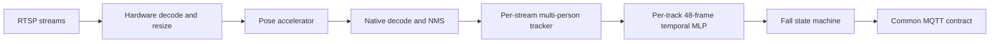

# EdgeFallKit

**15 FPS multi-person fall detection across Jetson, Hailo, RKNN, and reCamera.**


EdgeFallKit is one fall-detection stack verified on NVIDIA Jetson Orin Nano/NX, Rockchip
RK3576/RK3588, Raspberry Pi 5 + Hailo-8, reCamera SG2002, and reCamera Pro.
Python owns the readable control plane where the platform supports it; video
decode, preprocessing, inference, and pose postprocessing stay in GStreamer,
CUDA/TensorRT, RKNN, HailoRT, or small native extensions.

The repository includes multi-stream RTSP ingestion, independent tracking and
temporal state for every person, a common MQTT result contract, slim published
runtime images, one-command model preparation, and reproducible performance and
accuracy evidence. It is an engineering reference implementation, **not a
medical or emergency-response certification**.


*Synthetic UI demo using the production reCamera Pro debug panel and WebSocket
result schema. The two-person state sequence is injected for visualization; it
is not accuracy or performance evidence.*

## Highlights

- **One result contract:** every platform publishes the same reCamera-compatible
  MQTT schema with `stream_id`, `persons[]`, stable track IDs, and stream-global
  event IDs.
- **Real multi-person state:** each track owns an independent 48-frame temporal
  MLP and fall state machine; short occlusion does not silently swap histories.
- **Hardware-first hot paths:** Jetson NVDEC/VIC/CUDA/TensorRT, Rockchip
  MPP/RGA/RKNN plus C++ NMS, Hailo GStreamer/HailoRT, and native CVI inference.
- **Readable deployment:** Python controls RTSP reconnects, configuration,
  orchestration, tracking, and MQTT on Jetson/RK; production images contain no
  Torch, Ultralytics, ONNX Runtime, compiler, or model converter.
- **Models stay external:** an explicit-license helper downloads from the
  upstream provider, converts on the correct builder/target, verifies hashes,
  and reuses a provenance-aware cache.
- **Measured, not estimated:** device reports separate accelerator inference,
  pipeline throughput, CPU, RSS, utilization, power when available, image size,
  and accuracy scope.

## Quickstart

Choose a platform, review the upstream model terms, and run the dispatcher:

```bash
./deploy.sh jetson --device orin-nano --accept-upstream-license --deploy
./deploy.sh rk3576 --device cat-remote --accept-upstream-license
./deploy.sh rk3588 --device radxa --accept-upstream-license
./deploy.sh hailo --accept-upstream-license
```

The command pulls the published slim runtime, prepares the external pose model,
verifies its manifest, validates Compose, and starts the selected service.
Start with `--dry-run`; see [Deployment](docs/DEPLOYMENT.md) for offline, local
model, remote builder, and image override options.

Before deployment, edit the platform configuration with real RTSP URLs, stable
stream IDs, and MQTT broker/TLS credentials. Example addresses are not
production defaults.

## Contents

- [Highlights](#highlights)
- [Quickstart](#quickstart)
- [Supported platforms](#supported-platforms)
- [Measured results](#measured-results)
- [How it works](#how-it-works)
- [Published images and models](#published-images-and-models)
- [Configuration and MQTT](#configuration-and-mqtt)
- [Reproducible evaluation](#reproducible-evaluation)
- [Repository layout](#repository-layout)
- [Development and verification](#development-and-verification)
- [reCamera source layout](#recamera-source-layout)
- [Safety, licensing, and security](#safety-licensing-and-security)
- [Contributing](#contributing)
- [Acknowledgements](#acknowledgements)

## Supported platforms

| Platform | Control plane | Accelerated path | Deployment status |
|---|---|---|---|
| Jetson Orin Nano/NX | Python | NVDEC/VIC → CUDA preprocess → TensorRT 10.3 | Published RC1; Nano/NX pull-back verified |
| RK3576/RK3588 | Python | MPP/RGA → RKNNLite → pybind11 decode/NMS | Published RC1; both boards pull-back verified |
| Raspberry Pi 5 + Hailo-8 | Native runtime; Python-control migration documented | GStreamer → `hailonet` → native tensor decode | Published RC1; Pi pull-back verified |
| reCamera SG2002 | Native C++ | CVI Runtime INT8 | appMgr package; OS 0.2.2 verified |
| reCamera Pro | Python app | RV1126B RKNN | Signed package, live target, and frozen native/fallback S4 comparison verified |

SG2002 intentionally remains native C++: adding Python would not improve its
throughput or reliability. Hailo currently keeps the hot runtime native because
HailoRT 4.21 exposes tensor metadata through a C++ API but not the installed
Python GI bridge; the exact migration boundary is documented in
[PYTHON_CONTROL_PLANE.md](platforms/rpi-hailo/PYTHON_CONTROL_PLANE.md).

## Measured results

All figures below are frozen evidence from 2026-08-13. Different models and
latency scopes are shown explicitly; see the [full results ledger](evaluation/RESULTS.md)
before making a capacity or accuracy claim.

### Production RTSP path

| Device | Pose frontend | Measured RTSP output | Inference or probe P95 | Recommended starting capacity |
|---|---|---:|---:|---:|
| Orin Nano | YOLO11s-Pose TRT FP16 | 14.94 FPS | 14.79 ms infer | 4 × 15 FPS |
| Orin NX | YOLO11m-Pose TRT FP16 | 15.02 FPS | 21.03 ms infer | 3 × 15 FPS |
| RK3576 | YOLO11n-Pose RKNN FP16 | 14.90 FPS low stream | 65.74 ms pipeline | Validate 1–2 routes on final cameras |
| RK3588 | YOLO11n-Pose RKNN FP16 | 14.67 FPS low stream | 83.20 ms pipeline | Validate 1–3 routes on final cameras |
| Pi 5 + Hailo-8 | YOLOv8s-Pose HEF INT8 | 14.32 FPS single; 14.33+14.30 dual | 8.36 / 15.43 ms Hailo probe | 2 × 15 FPS verified |
| reCamera Pro | YOLO11n-Pose RKNN INT8 | 13.05 FPS live WebSocket | 39.36 ms infer / 85.99 ms pipeline | 1 live camera verified |

The 15 FPS rows are source-rate SLA checks, not a hardware ranking. Timing
boundaries and known risks are documented in the
[performance fairness audit](evaluation/PERFORMANCE_FAIRNESS.md).

### Frozen GMDCSA Subject 4

| Frontend/profile | Accuracy | Recall | Specificity | F1 | Mean alert latency |
|---|---:|---:|---:|---:|---:|
| reCamera CVI baseline | 74.1% | 83.3% | 66.7% | 74.1% | 1.75 s |
| Jetson YOLO11s optimized | 81.5% | 83.3% | 80.0% | 80.0% | 1.47 s |
| Jetson YOLO11m optimized | 85.2% | 100% | 73.3% | 85.7% | 1.26 s |
| RK3576 native temporal gate | 88.9% | 100% | 80.0% | 88.9% | 1.49 s |
| RK3588 native temporal gate | 88.9% | 100% | 80.0% | 88.9% | 1.53 s |
| reCamera Pro production fallback on Pro traces | 81.5% | 91.7% | 73.3% | 81.5% | 1.22 s |
| reCamera Pro native experiment | 70.4% | 75.0% | 66.7% | 69.2% | 1.47 s |
| Hailo-8 native temporal gate | 88.9% | 100% | 80.0% | 88.9% | 1.61 s |

The clean test has 27 clips. RK/Hailo rows measure the frozen temporal gate;
they must not be relabeled as full deployed-state-machine accuracy. Jetson also
has RealBiomFall external-set evidence; RK/Hailo external evaluation remains a
documented follow-up.

## How it works



Python is used as a control plane where it improves readability and deployment.
Per-pixel work and model output decoding stay below Python. The state machine
does not alert from geometry alone by default: geometry creates `suspected`, a
valid temporal confirmation creates `fallen`, and recovery/cooldown suppresses
event chatter. Missing observations cannot originate a new event.

Multi-stream deployment uses independent decode/inference contexts and trackers.
Jetson production uses batch 1; the measured static batch-4 experiment is a
throughput artifact, not the current application ABI.

## Published images and models

| Runtime | Published image | Immutable RepoDigest |
|---|---|---|
| Jetson | `sensecraft-missionpack.seeed.cn/solution/fall-detection-jetson:0.1.0-rc1` | `sha256:162824bedda86eeadb1bc265b21ae14bb264ad907f68f3ea001db745e38f32ff` |
| RKNN | `sensecraft-missionpack.seeed.cn/solution/fall-detection-rknn:0.1.0-rc1` | `sha256:e13c0d3bac963ac78b2d067deee6880aa3058e65f41c700af1b1718129685dc7` |
| Hailo | `sensecraft-missionpack.seeed.cn/solution/fall-detection-rpi-hailo:0.1.0-rc1` | `sha256:1243fb26141a43f67434e1954e6f7ff227e27b8de8aabe2a50a0e3cb48f823a0` |

All three are Linux/ARM64 and were pulled back on their target devices. Models
are deliberately excluded:

- Jetson exports ONNX in an isolated builder and builds the TensorRT engine on
  the destination Orin, because engines are target/ABI/profile specific.
- RK conversion runs in an x86_64 RKNN Toolkit 2.3.2 builder, then Fleet sends
  only the target `.rknn` and temporal profile to the board.
- Hailo downloads the official v2.15 Hailo-8 HEF URL and verifies its fixed
  SHA256.

The helpers never upload these third-party model artifacts. See
[Model assets and provenance](docs/MODEL_ASSETS.md) and
[Third-party notices](THIRD_PARTY_NOTICES.md).

## Configuration and MQTT

Each stream needs a stable ID and RTSP URL. MQTT broker host, port, client ID,
topic, credentials, TLS, QoS, and retain behavior are platform-configurable.
Multiple streams share a configurable broker but maintain independent frame,
track, temporal, and event histories.

The contract preserves reCamera top-level fields and adds stable multi-stream
semantics:

- `person_count`: currently visible people.
- `fallen_count`: retained tracks in `fallen` or `recovering`, including short
  occlusion grace.
- `persons[]`: per-track state, event ID, normalized box, features, and COCO-17
  pose.
- `event_id` / `global_event_id`: monotonic within one stream.
- `fall_event`: a one-frame edge; `fall_detected` remains true through the
  active fall/recovery state.

Read [MQTT.md](contracts/MQTT.md) and validate captured JSON with:

```bash
python3 contracts/validate_payload.py payload.ndjson
```

## Reproducible evaluation

The frozen split is Subjects 1–2 fit, Subject 3 hyperparameter selection,
Subjects 1–3 refit, then Subject 4 read only after the profile hash is frozen.
Videos are sampled at 15 FPS and tracker/temporal state resets between clips.

- [Cross-platform results](evaluation/RESULTS.md)
- [Evaluation protocol](evaluation/EVALUATION.md)
- [Delivery readiness](DELIVERY_STATUS.md)
- [Asset and backup inventory](assets/ASSET_LOCATIONS.md)
- [Reproducible LAN RTSP fixture](tools/rtsp-fixture/README.md)

Large datasets, traces, and target-built models are not committed. Spark is the
durable internal backup; public dataset downloaders retain upstream sources and
checksums.

## Repository layout

```text
platforms/
  jetson/          Python + CUDA/TensorRT native bridge
  rknn/            Shared Python + RKNN/MPP/RGA implementation
  rk3576/          RK3576 config, Compose, temporal profile, evidence
  rk3588/          RK3588 config, Compose, temporal profile, evidence
  rpi-hailo/       HailoRT/GStreamer runtime and deployment
  recamera-sg2002/ Symlink to the canonical native solution
  recamera-pro/    Symlinks to the canonical Pro app and kit
contracts/         MQTT documentation, JSON Schema, validator
evaluation/        Protocol, frozen results, reports, checksums
assets/            Provenance and durable-storage inventory
docs/              Deployment and model-license guidance
tools/             Repository checks and RTSP fixture
```

## Development and verification

Run the release checks first. They validate all Compose files, JSON configs,
MQTT fixtures, report checksums, shell syntax, Markdown links, and supported
batching documentation:

```bash
./tools/verify_baseline.sh
```

Jetson host-only core tests do not require CUDA/TensorRT:

```bash
cmake -S platforms/jetson -B /tmp/fall-jetson-host \
  -DBUILD_APP=OFF -DBUILD_TESTING=ON
cmake --build /tmp/fall-jetson-host -j4
ctest --test-dir /tmp/fall-jetson-host --output-on-failure
```

Platform READMEs contain native build, model preparation, backend fallback,
benchmark, and device ABI instructions. Use the actual device power mode,
codec, cameras, scene density, and broker when establishing route capacity.

## reCamera source layout

SG2002 and Pro remain owned by their canonical sibling repositories. The
expected checkout is:

```text
<workspace>/
├── fall-detection/
└── recamera/
    ├── sscma-example-sg200x/
    └── recamera_pro/
```

| Project entry | Canonical source |
|---|---|
| `platforms/recamera-sg2002` | `../recamera/sscma-example-sg200x/solutions/fall-detection` |
| `platforms/recamera-pro/app` | `../recamera/recamera_pro/apps/fall-detection` |
| `platforms/recamera-pro/kit` | `../recamera/recamera_pro/kit` |

Keep this layout or recreate the relative links. Configure SG2002 from its
canonical path so its `../../cmake` framework path resolves correctly:

```bash
cmake -S ../recamera/sscma-example-sg200x/solutions/fall-detection \
  -B /tmp/fall-recamera-build
```

Commit changes to those canonical repositories separately; this project owns
the shared contract, deployment entry point, and comparison ledger.

## Safety, licensing, and security

Original project code and documentation are licensed under
[Apache-2.0](LICENSE). That license does not cover automatically downloaded
models, converted outputs, datasets, vendor SDKs, or linked repositories.
Review [THIRD_PARTY_NOTICES.md](THIRD_PARTY_NOTICES.md) before enabling model
download. `--accept-upstream-license` is acknowledgement, not a license grant.

Do not commit RTSP/MQTT credentials. Use TLS and per-device broker credentials
outside trusted development networks, pin images by digest, and follow
[SECURITY.md](SECURITY.md). Fall alerts are decision support; deployments need
their own risk analysis, escalation policy, and human verification.

## Contributing

See [CONTRIBUTING.md](CONTRIBUTING.md). Performance changes need target-device
evidence; accuracy changes must preserve the frozen subject split and report
temporal-gate versus deployed-state-machine scope separately.

## Acknowledgements

This project integrates NVIDIA TensorRT/CUDA, Rockchip RKNN/MPP/RGA, HailoRT
and Hailo Model Zoo, GStreamer, Eclipse Mosquitto, OpenCV, and the reCamera
platform SDKs. Pose models and evaluation datasets retain their upstream
credits and terms. See the platform READMEs and third-party notices for exact
versions and provenance.

Release history is recorded in [CHANGELOG.md](CHANGELOG.md).
The immutable container references for this release are also available in the
[machine-readable RC manifest](release/0.1.0-rc1.json).
